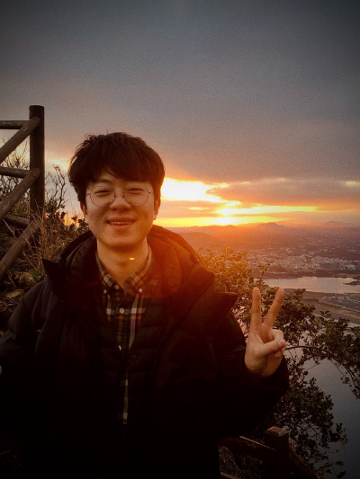

## Saenal Cha

 

I'm web front-end developer interested in building a good usability application. 
I prefer well-structured readable code.
I like lean software development.
Currently, I am working on the microservice architecture environment.

 

### Languages and Technologies

---
**Languages**: TypeScript, JavaScript, HTML/CSS, SCSS, SQL, Kotlin, PHP, C

**Technologies**: React.js, Next.js, Vue.js, Nuxt.js, Node.js, Express.js, Apollo GraphQL, AWS, Jenkins, docker

Other: Jest, Storybook, Browserstack, Charles, Bitbucket

 

### Work Experience

---

Web Front-end Developer. [Hyperconnect](https://hyperconnect.com/en/), 2022. 7. 11. ~ 2023. 7. 31.

* WebRTC content moderation web application 
  * React, TypeScript, react-router, react-query, Zustand, MUI, emotion/styled, openapi-generator
* AI labeling web application (for model training)
  * React, TypeScript, react-router, react-query, Zustand, MUI, emotion/styled, openapi-generator

---

Web Front-end Developer. [yanolja](https://yanolja.in/en/), 2019. 4. 15. ~ 2022. 7. 14.

* Enterprise Dashboard Site (for a settlement)
  * React(Next.js), TypeScript, Redux, Node.js, Antd
* Order Dashboard Site
  * Launch new dashboard site for integrate several categories(reservation, leisure, transportation) dashboard sites
  * React(Next.js), Apollo + GraphQL, recoil, emotion/styled, antd
* Order site for webview
  * Nuxt.js
* Order list site for webview
  * Nuxt.js

---

Web Front-end Developer. [publy](https://publy.co/), 2016. 12. 6. ~ 2019. 4. 12.

* React Native App
  * Expo
* Membership subscription service
  * Vue.js, Bootstrap, PHP 7 Laravel
* Product design
  * Sketch App

 

### Education

---

March 2021 ~ current. Computer Science. [Korean National Open University](https://en.wikipedia.org/wiki/Korea_National_Open_University), Seoul, Korea.
 
March 2009 ~ February 2016. Visual Communication Design, B.F.A, [Hongik University](https://en.wikipedia.org/wiki/Hongik_University), Seoul, Korea.

